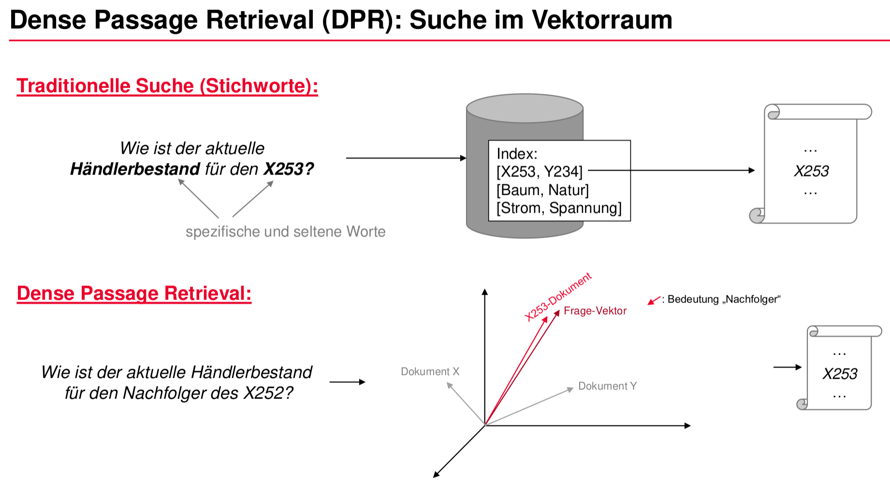

# Dense Passage Retrieval für die eigene Domäne

Wer mehr darüber erfahren will, wie neuronale Suche funktioniert, muss aktuell einige fragmentierte Quellen und
wissenschaftliche Paper in englischer Sprache wälzen. Dense Passage Retrieval ist ein neuronales Suchverfahren, bei
welchem mithilfe einer textuellen Suchanfrage wiederum Dokumente in Textform durchsucht werden können. Dieser Artikel
soll einen sanften Einstieg in die (gar nicht so harte) Mathe liefern, die dahinter steckt.
Wie [Tokenization](https://huggingface.co/docs/transformers/main_classes/tokenizer),
die [Transformer-Architektur](https://huggingface.co/docs/transformers/model_summary)
und [Attention-Mechanismen](https://huggingface.co/docs/transformers/main/attention) funktionieren wird hier *nicht*
beschrieben - diese Informationen sind im Internet aber leicht auffindbar.

Zusätzlich zu diesem Artikel wird in [einem Begleit-Repository auf GitHub](https://github.com/schreon/DPR-Explained)
gezeigt, wie sich diese Mathe in Python Code implementieren lässt. In einem Folge-Artikel im kommenden iX Sonderheft
wird dann gezeigt, wie man mit dem resultierenden Modell in Kombination mit dem
Framework [haystack](https://github.com/deepset-ai/haystack) ein produktionstaugliches neuronales Suchsystem aufbauen
kann. Zusätzlich wird dann ein Datensatz veröffentlicht, der zusammen mit der Landeshauptstadt München entwickelt wurde.
Wer also über keinen eigene Dokumentsammlung verfügt, kann auf das Sonderheft warten und dann loslegen.

## TF•IDF

Beim Verständnis von DPR hilft zunächst der Vergleich zu den weit verbreiteten Information Retrieval Systemen, die auf
TF•IDF basieren. Da TF•IDF als gute Baseline dient und auch in der Ära der neuronalen Netze seine Daseinsberechtigung
hat, folgt hier ein kurzer Umriss dieser Methode. Es werden hier nur die wesentlichen Punkte erklärt, die für den
Vergleich mit DPR hilfreich sind. Verfeinerte TF•IDF Methoden, wie beispielsweise BM25, werden hier nicht erörtert, da
hierzu bereits sehr viele Quellen existieren, die im Internet leicht auffindbar sind.

TF•IDF steht für *Term Frequency • Inverse Document Frequency*, zu Deutsch etwa *Termhäufigkeit • Inverse
Dokumenthäufigkeit*. Der Name verrät schon, dass es bei diesem statistischen Maß im wesentlichen darum geht, Terme (also
Wörter) in Dokumenten zu zählen. Dabei ist das Ziel vereinfacht ausgedrückt, insbesondere Wörter zu zählen, die ein
Dokument besonders unterscheidbar machen von allen anderen Dokumenten. Genauer ausgedrückt möchte man eine Funktion, die
einen gegebenen Term $t$ und ein Dokument $d$ betrachtet und besonders hohe Werte liefert, wenn $t$ häufig in dem
Dokument vorkommt und gleichzeitig sehr spezifisch ist, und niedrig, wenn $t$ entweder in dem Dokument nur selten
vorkommt oder ein sehr geläufiger, unspezifischer Term ist. Dies erreicht man durch das Produkt der Termhäufigkeit (TF)
mit dem Logarithmus der inversen Dokumenthäufigkeit (IDF), resultierend in TF•IDF. Dies wird im Folgenden hergeleitet.

Die Termhäufigkeit $\mathrm{tf}$ sagt aus, wie oft ein Term $t$ in einem Dokument vorkommt, relativ zur Länge des
Dokuments (welche gleich der Summe der Häufigkeiten aller bekannten Terme $t$ im Dokument $d$ ist). Sie ist wie folgt
definiert:

$\mathrm{tf}(t, d) = \frac{\text{Haeufigkeit des Terms t in Dokument d}}{\text{Anzahl aller Woerter in Dokument d}} =
\frac{f_{t,d}}{{\sum_{t' \in d}{f_{t',d}}}}$

Nun gilt es, zusätzlich abzubilden, wie *spezifisch* ein Term ist, das heißt, wie gut er sich als Indikator für die
Unterscheidung von Dokumenten eignet. Dabei wird die Annahme getroffen, dass ein Term dann besonders spezifisch ist,
wenn er nur in wenigen Dokumenten vorkommt. Sogenannte Stoppwörter wie "die", "aber", "und" kommen in fast allen
Dokumenten vor und hätten somit eine sehr geringe Spezifizität. Ein Begriff wie "Urlaubsantrag" kommt hingegen nur in
einem Bruchteil aller Dokumente vor und ist somit deutlich spezifischer als ein Stoppwort. Intuitiv wird die
Dokumenthäufigkeit durch das folgende Verhältnis beschrieben:

$\frac{\text{Anzahl der Dokumente, die den Term t enthalten}}{\text{Anzahl aller Dokumente}}$

Je höher die Dokumenthäufigkeit, desto geläufiger ist ein Term $t$ in allen vorliegenden Dokumenten $D$. Es ist hingegen
erstebenswert, eine Funktion $\mathrm{idf(t, D)}$ zu erhalten, die besonders dann hohe Werte liefert, wenn der Term $t$
nur in wenigen Dokumenten vorkommt, somit also sehr spezifisch ist (so wie "Urlaubsantrag"). Im Gegensatz dazu soll sie
besonders niedrige Werte liefert, wenn der Term sehr geläufig ist, also in sehr vielen Dokumenten vorkommt (so wie
beispielsweise die Stoppwörter "die", "aber", "und"). Dies erreicht man, indem man den Logarithmus des Inversen des oben
genannten Verhältnis betrachtet. Die Funktion $\mathrm{idf}(t, D)$ ist somit definiert als:

$\mathrm{idf}(t, D) = \log \frac{N}{|d \in D: t \in d|}$

Das zusammengesetzte TF•IDF Maß ist dann das Produkt $\mathrm{tf}(t, d) \cdot \mathrm{idf}(t, D)$. Es hängt von einem
Term $t$, einem Dokument $d$ und einer Dokumentsammlung $D$ ab, mit $t \in d$ und $d \in D$. Das Maß hat dann hohe
Werte, wenn $t$ sowohl oft in $d$ vorkommt, aber selten in der gesamten Dokumentsammlung $D$. Kommt $t$ oft in $d$ vor,
aber auch oft in der gesamten Dokumentsammlung $D$, dann ist der Wert trotzdem niedrig (weil der Logarithmus in der
$\mathrm{idf}$ Funktion das Produkt in diesem Fall stark gegen 0 zieht).

Um zwei Dokumente $d_1$ und $d_2$ miteinander vergleichen zu können, wird die Statistik der TF•IDF Werte über alle Terme
$t$ aus dem gesamten Vokabular $V$ herangezogen. Dabei wird für jedes Dokument $d$ ein Dokumentvektor $v_d$ erstellt,
der sich aus den einzelnen TF•IDF Werten zusammensetzt. Somit repräsentiert jede Dimension $i$ in einem solchen
Dokumentvektor $v_d$ die Statistik über ein bestimmtes Wort (einen Term) $t_i$ aus dem Vokabular $V$ im vorliegenden
Dokument $d$:

$v_{d, i} = \mathrm{tf}(t_i, d) \cdot \mathrm{idf}(t_i, D)$

Um die Ähnlichkeit zweier Dokumente $d_1$ und $d_2$ festzustellen, kann nun eine Ähnlichkeit zwischen ihren beiden
Dokumentvektoren $v_{d_1}$ und $v_{d_2}$ berechnet werden. Hierzu ist zunächst ein Ähnlichkeitsmaß notwendig. Üblich im
Information Retrieval ist an der Stelle die Kosinusähnlichkeit, die folgendermaßen definiert ist:

$\mathrm{cosine_sim}(q, p) = \frac{q \cdot p}{\max(\lVert q {\rVert}_2 \cdot \lVert p {\rVert}_2, \epsilon)}$

Wenn man nun die Annahme trifft, dass eine hohe Übereinstimmung der TF•IDF Statistik einer Suchanfrage mit der TF•IDF
Statistik eines Dokuments ein geeigneter Indikator für eine semantische Übereinstimmung ist, dann kann man damit eine *
k-nearest-neighbor*-Suche bauen. Wie stark oder schwach diese Annahme in der Praxis greift, spürt man, wenn man in der
Intranetsuche seiner Organisation beispielsweise nach "Urlaubsantrag" sucht, man aber keinen einzigen Treffer erzielt,
weil in den relevanten Dokumenten nur von "Antrag auf Urlaub" die Rede ist. Das liegt daran, dass diese Modellierung
keine Repräsentierung von Sprache an sich beinhaltet und über kein Weltmodell verfügt, sondern ausschließlich die
Häufigkeiten bestimmter Buchstabenfolgen berücksichtigt. Somit besteht zwischen dem Wort $t_1 = \text{"Urlaubsantrag"}$
und $t_2 = \text{"Urlaub"}$ zwar ein semantischer Zusammenhang, in der TF•IDF Modellierung wird diese Semantik aber in
keiner Weise berücksichtigt. Somit hat "Urlaubsantrag" nichts mit "Urlaub" zu tun. Und der Plural "Urlaubsanträge" hat
keinen Zusammenhang dem Singular "Urlaubsantrag".

In der Praxis versucht man, diese Schwächen von TF•IDF mit verschiedenen Maßnahmen zu dämpfen: Beispielsweise werden die
Texte normalisiert, indem Wörter alle in Kleinschreibweise und Stammformen überführt werden. Zusätzlich entfernt man
Umlaute, Akzente und so weiter. Auch die Abbildung auf andere Terme mithilfe von Synonymlisten ist gängig. Auf die Weise
wird dann aus "Urlaubsantrag" vielleicht "urlaubsantrag" und aus "Urlaubsanträge" ebenfalls "urlaubsantrag". Dann kann
man nach "Urlaubsanträge" suchen und findet trotzdem Dokumente, in denen lediglich "Urlaubsantrag" vorkommt, weil beides
auf die Stammform "urlaubsantrag" abgebildet wird.

Diese praktischen Hacks werden an dieser Stelle nicht weiter erläutert. Es sollte aber klar sein, dass auf TF•IDF
basierende Information Retrieval Systeme an Grenzen stoßen, die in fundamentalen Mängeln begründet liegen: Es fehlt ein
semantischer Zusammenhang zwischen den Termen, sie tragen keinerlei Kontextinformation, die Bedeutung des Satzgefüges
und die Feinheiten der verwendeten Sprache werden nicht berücksichtigt.

## Von TF•IDF zu Sprachmodellen und DPR

Sprachmodelle haben das Potenzial, die Grenzen von wortfrequenzbasierten Verfahren wie TF•IDF zu überwinden. Dies
gelingt insbesondere mit [tiefen neuronalen Netzen vom Typ *Transformer*](https://arxiv.org/abs/1706.03762), welche auf
dem [Attention-Mechanismus](https://arxiv.org/abs/1409.0473) beruhen. Das in diesem Artikel vorgestellte
Verfahren ["Dense Passage Retrieval" (DPR)](https://arxiv.org/abs/2004.04906) basiert auf solchen Sprachmodellen und ist
eine Alternative zu TF•IDF Retrieval Systemen.

Wie bei TF•IDF werden bei DPR sowohl die Anfragen als auch die suchbaren Dokumente in denselben hochdimensionalen Raum
mit $D$ Dimensionen abgebildet. Innerhalb von diesem kann dann eine *k-nearest-neighbor*-Suche durchgeführt werden.
Einer der wesentlichen Unterschiede von DPR gegenüber TF•IDF besteht darin, dass jede der $D$ Dimensionen *nicht* für
die Frequenz des Vorkommens eines bestimmten Schlüsselworts steht. Beim DPR-Verfahren definieren die $D$ Dimensionen die
Koordinaten in einem $D$-dimensionalen Raum. Sie sind somit wie die `x`, `y` und `z` Koordinaten im 3D-Raum zu
interpretieren. Wer möchte, kann versuchen, sich ein Koordinatensystem mit 768 Koordinaten-Achsen vorzustellen. Die
Aufgabe der neuronalen Netze ist, diese Punkte so anzuordnen, dass zueinander semantisch ähnliche Dokumente in diesem
Raum nah beieinander liegen. Was in diesem Zusammenhang "Nähe" bedeutet, wird später über das gewählte Ähnlichkeitsmaß
bestimmt. Weiterhin sind bei TF•IDF die meisten Dimensionen in den Anfrage- und Dokumentenvektoren *gleich null*, weil
die meisten Schlüsselworte aus dem Vokabular in einem einzelnen Text nicht vorkommen. Es handelt sich somit bei TF•IDF
um einen dünnbesetzten Vektor (*sparse vector*). Bei DPR ist jede Dimension der Anfrage- und Dokumentenvektoren
meistens *ungleich null* (so, wie die x/y/z-Koordinaten der Objekte in einem 3D-Raum auch meistens nicht 0 sind, sondern
irgendwo im Raum verteilt liegen). Dieser Unterschied erklärt auch das Wort *dense* (engl.: "dicht") im Namen des
Verfahrens "Dense Passage Retrieval". Ein weiterer Unterschied von DPR verglichen mit Systemen basierend auf TF•IDF
liegt im verwendeten Ähnlichkeitsmaß, anhand von dem die *k-nearest-neighbor*-Suche durchgeführt wird. TF•IDF beruht
üblicherweise auf der oben beschriebenen Kosinusähnlichkeit. Von den Autoren des DPR-Papers wurde jedoch gezeigt, dass
sich für DPR das bloße Skalarprodukt als Ähnlichkeitsmaß besser eignet. Das Skalarprodukt bleibt übrig, wenn man in der
oben beschriebenen Formulierung der Kosinusähnlichkeit die Normalisierung streicht. Dies ergibt ein Ähnlichkeitsmaß,
welches im Folgenden $\text{sim}$ genannt wird:

$\text{sim}(q, p) = q \cdot p$

Nun stellt sich die Frage, wie die Anfragevektoren $q$ und die Dokumentvektoren $p$ im Rahmen des DPR-Verfahrens
berechnet werden. Der in diesem Artikel vorgeschlagene Lösungsansatz ist eine von vielen Möglichkeiten, wie man ein
DPR-Modell implementieren kann. Die
Implementierung [im Begleit-Repository dieses Artikels](https://github.com/schreon/DPR-Explained) orientiert sich
allerdings stark an der von den Autoren des [originalen DPR-Papers](https://arxiv.org/abs/2004.04906) vorgeschlagenen
Variante und der [dazugehörigen Implementierung](https://github.com/facebookresearch/DPR). Sie ist mit
der [DPR-Implementierung im huggingface `transformers`-Paket](https://huggingface.co/docs/transformers/model_doc/dpr)
kompatibel. Das DPR-Verfahren ist grundsätzlich mit allen Typen von neuronalen Netzen umsetzbar, die in der Lage sind,
Text einzulesen und Repräsentationsvektoren für den eingelesenen Text zu generieren. Sinnvoll als Ausgangspunkt sind
aber im aktuellen Stand der Technik vor allem vortrainierte *Encoder*-Sprachmodelle. Die internen Funktionsweisen von
Encoder-Sprachmodellen werden an dieser Stelle nicht beschrieben. Dieser Artikel beschränkt sich auf den Aufbau der Ein-
und Ausgaben dieser Modelle und lässt offen, wie deren interne Architektur gestaltet wird.

Ein solches Encoder-Sprachmodell liefert für eine Eingabe-Sequenz aus Tokens eine korrespondierende Ausgabe-Sequenz
derselben Länge, bestehend aus kontextualisierten *Embedding*-Vektoren. Dem tokenisierten Text wird ein
spezielles `[CLS]`-Token vorangestellt. Die Aktivierungen der letzten Schicht aus dem Transformer-Netz an der Stelle
des `[CLS]`-Tokens werden extrahiert und als Repräsentationsvektor `q` (Anfragen) bzw `p` (Dokumente) verwendet.

Prinzipiell könnte dasselbe Sprachmodell sowohl für die Berechnung der Anfragevektoren `q` als auch für die
Dokumentenvektoren `p` verwendet werden. Die Autoren des DPR-Papers empfehlen aber zwei Instanzen desselben
ursprünglichen Sprachmodells: ein Encoder für die Anfragen, im huggingface `transformers`-Paket eingebettet in die
Klasse `DPRQuestionEncoder`, und ein Encoder für die Dokumente, analog eingebettet in die Klasse `DPRContextEncoder`.

## Loss-Funktion bei Dense Passage Retrieval

Wenn man eine Anzahl $Q$ Anfragevektoren $q_i$ der Länge $D$ zusammenfasst, erhält man einen Tensor $q$ des Rangs 2 und
der Form $(Q, D)$. Analog können $P$ Dokumentenvektoren $p_j$ zu einem Tensor $p$ des Rangs 2 mit der Form $(P, D)$
zusammengefasst werden. Dann kann man die paarweisen Ähnlichkeiten $\text{sim}(q_i, p_j)$ der Anfragen und Dokumente
mithilfe einer Matrixmultiplikation von $q$ und $p$ berechnen. Der resultierende Tensor hat dann ebenfalls den Rang 2
und die Form $(Q, P)$. Die
Funktion [`sim` im begleitenden Git-Repository in `dprexplained/loss.py`](https://github.com/schreon/DPR-Explained/blob/main/dprexplained/loss.py#L7)
zu finden.

Dieses Ranking-Problem kann durch eine raffinierte Formulierung als Multi-Klassifikationsproblem betrachtet werden.
Gegeben seien der Anfragevektor $q_i$ mit dem Soll-Dokumentenvektor $p_i^+$ und eine Menge an irrelevanten
Dokumentenvektoren $p_{i,j}^-$. Die Menge aller gegebenen Dokumentenvektoren ist dann $P_i = \{p_i^+, p_{i, 1}^-, ...,
p_{i, n}^- \}$. Nun kann eine Wahrscheinlichkeit formuliert werden, die in etwa folgendes aussagt: Wie wahrscheinlich
ist es, dass ein Klassifikator in Anbetracht einer Anfrage $q_i$ den korrekten Soll-Dokumentenvektor $p_i^+$ aus der
Menge aller Dokumente $P_i$ auswählt? Für jeden Dokumentenvektor $p$ gibt es dann eine entsprechende Klasse. *Wichtig:
Hier dient die Modellierung als Wahrscheinlichkeit nur als Vehikel, um einen geeigneten Loss zu formulieren und das
Modell zu trainieren. Im Produktionsbetrieb bzw. zur Inferenzzeit ist das Verfahren deterministisch und nicht
stochastisch.*

Zur Modellierung einer Wahrscheinlichkeitsverteilung über mehrere Klassen eignet sich die *Softmax-Funktion*. Dabei wird
ein Vektor $z$ aus $|K|$ reellen Zahlen, die jeweils einen unnormalisierten Score $z_i$ für die Wahrscheinlichkeit einer
Klasse $k_i \in K$ repräsentieren, in eine Wahrscheinlichkeitsverteilung umgewandelt. Die Wahrscheinlichkeit $\sigma(z)_
i$, dass die Klasse $k_i$ aus der Menge möglicher Klassen $K$ ausgewählt wird, berechnet sich gemäß der
Softmax-Formulierung wie folgt:

$\sigma(z)_i = \frac{e^{z_i}}{\sum_{j=1}^{\left|K\right|} e^{z_j}}$

Betrachtet man die Ausgabe der oben definierten Ähnlichkeitsfunktion $\text{sim}$ als den unnormalisierten Score $z_i$,
so kann man diese in die Softmax-Formulierung einsetzen:

$\sigma(z)_i = \frac{e^{\text{sim}(q_i,p_{i}^+)}}{e^{\text{sim}(q_i,p_{i}^+)} + \sum_{j=1}^n{e^{\text{sim}(q_i,p_
{i,j}^-)}}}$

Die übliche Methode, eine Wahrscheinlichkeit zu maximieren, ist, die *Negative Log Likelihood (NLL)* zu minimieren. Und
damit gelangt man zur Formulierung des Loss $L$:

$L(q_i, p{_i}^+, p_{i, 1}^-, ..., p_{i, n}^-)=-\log(\sigma(z)_i)=-\log\frac{e^{\text{sim}(q_i,p_{i}^+)}}{e^{\text{sim}(
q_i,p_{i}^+)} + \sum_{j=1}^n{e^{\text{sim}(q_i,p_{i,j}^-)}}}$

Am besten wäre es, für jedes Anfrage/Dokument-Paar $(q_i, p{_i}^+,)$ alle anderen Dokumente aus dem vorliegenden
Datensatz als Negativbeispiele $p_{i,j}^-$ zu verwenden. Dies ist aber mit Hinblick auf den Rechen- und Speicheraufwand
nicht machbar. Daher verwendet man in der Praxis einen Trick, bei dem nur ein Bruchteil der Dokumente zur selben Zeit
geladen und zur Berechnung des Loss herangezogen wird. Dabei werden gleich mehrere Anfrage/Dokument-Paare $(q_i, p{_
i}^+)$ aus dem Gesamtdatensatz ausgewählt. Diese formen dann einen sogenannten *Minibatch*. Nun werden für jede Anfrage
$q_i$ aus diesem Minibatch alle anderen Dokumente $p{_j}^+$ als Negativdokumente für $q_i$ betrachtet. Diese bezeichnet
man als *in-batch negatives*. Der Liste an Negativdokumenten können zusätzlich noch sogenannte *hard negatives*
hinzugefügt werden. Damit sind zusätzliche Negativdokumente gemeint, die den eigentlichen Soll-Dokumenten pro Anfrage
sehr ähnlich sind und sich somit schwer unterscheiden lassen. Im Rahmen dieses Artikels und der
Implementierung [im Begleit-Repository](https://github.com/schreon/DPR-Explained) wird dies jedoch nicht behandelt.

Eine mögliche Implementierung des oben hergeleiteten Loss in Kombination mit dem *in-batch negatives* Trick
ist [in Form der Funktion `dpr_loss` im begleitenden Git-Repository](https://github.com/schreon/DPR-Explained/blob/main/dprexplained/loss.py#L22)
in `dprexplained/loss.py` zu finden.

## Aufteilung in Passagen

Sprachmodelle sind sehr rechenintensiv. Das liegt vor allem daran, dass der Attention-Mechanismus, auf dem die
Transformer-Architekturen beruhen, sowohl in der Rechen- als auch der Speicherkomplexität quadratisch mit der
Sequenzlänge wächst. Das heißt, dass die in akzeptabler Zeit und mit akzeptablen Resourcen berechenbare Textlänge
begrenzt ist. Zwar kann dieser Resourcenhunger durch verschiedene Maßnahmen gedämpft werden (z.B. durch sogenannte *
Sparse Attention*), in der vorliegenden Anleitung wird jedoch einfach die maximale Sequenzlänge auf 200 Tokens begrenzt.
Dies hat zur Folge, dass die vorliegenden Texte in *Passagen* eingeteilt werden müssen. Dies
ist [im Git-Repository in `01_prepare_data.py`](https://github.com/schreon/DPR-Explained/blob/main/01_prepare_data.py)
umgesetzt.

Die einzelnen Passagen verlieren allerdings den Kontext des Gesamtdokuments. Dadurch sind manche Passagen nicht mehr
sinnvoll suchbar. Beispielsweise könnte ein Artikel, der von den verschiedenen Regeln und Zuständigkeiten rund um die
Hundesteuer handelt, am Ende eine Address- und Telefonliste enthalten. Wäre dieser Artikel besonders lang, dann würde
diese Liste womöglich in einer separaten Passage landen. Stellt man nun die Anfrage "Wo muss ich anrufen, wenn ich
meinen neuen Hund zur Hundesteuer anmelden will?", dann kann die entsprechende Antwort nicht gefunden werden. Ein
einfacher Hack ist an der Stelle, wiederum TF•IDF zu nutzen. Dabei werden für jedes Dokument geeignete Schlüsselwörter
ermittelt. Das Dokument wird dann in einzelne Passagen aufgeteilt, an die jeweils die Schlüsselworte angehängt werden.
Auf diese Weise erhält jede Passage einen Kontext abhängig vom Gesamtdokument.

## Training von Dense Passage Retrieval Modellen

Um ein DPR-Modell zu trainieren, sind Daten bestehend aus Such-Anfragen und zugeordneten Soll-Ergebnisdokumenten
notwendig. Diese sind sehr aufwändig zu erheben, daher werden bestehende Frage & Antwort Datensätze wie z.B. SQuAD
zweckentfremdet. Leider sind öffentliche und zudem deutschsprachige Datensätze dieser Art rar. Ein solcher Datensatz ist
deepset's [GermanDPR](https://huggingface.co/datasets/deepset/germandpr), welcher
von [GermanQUaD](https://huggingface.co/datasets/deepset/germanquad) abgeleitet wurde. Das dazugehörige Paper
ist [hier zu finden](https://arxiv.org/abs/2104.12741). Allerdings beziehen sich diese Datensätze auf sehr allgemein
gestreutes Wissen über einen Teil der deutschen Wikipedia. Liegen sehr domänenspezifische Dokumente vor, in denen viel
Fachvokabular verwendet wird, dann liefern Modelle, die auf GermanDPR trainiert wurden, oftmals unzufriedenstellende
Ergebnisse. In solchen Fällen sind oftmals sogar klassische TF•IDF Systeme besser, weil diese nicht erst den
Zusammenhang der Sprache lernen müssen. Um ein allgemeines, neuronales DPR-Modell auf das eigene Fachvokabular zu
spezialisieren, wäre es optimal, einen domänenspezfisichen Frage & Antwort Datensatz zu annotieren. Das kann
beispielsweise über das [haystack annotation tool](https://docs.haystack.deepset.ai/docs/annotation) gemacht werden.

## Inverse Cloze Task (ICT) Training

Doch selbst wenn keine annotierten Daten zur Verfügung stehen (und die Erstellung zu aufwändig wäre), kann man
DPR-Modelle auf eine spezifische Domäne anpassen. Dies geht beispielsweise über
die [sogenannte Inverse Cloze Task](https://aclanthology.org/P19-1612/) Methode (ICT). Dabei wendet man einen sehr
simplen Hack an: Aus einem Dokument werden zufällige Sätze gewählt, die dann als Pseudo-Anfrage behandelt werden. Eine
vereinfachte Implementierung von
ICT [ist in `02_train_ict.py`](https://github.com/schreon/DPR-Explained/blob/main/02_train_ict.py) umgesetzt. Auf diese
Weise lernt ein bereits vortrainiertes Sprachmodell, mit domänenspezifischen Begriffen und Spracheigenheiten umzugehen.

## Zusammenfassung und Schluss

In diesem Artikel wurde der Unterschied zwischen TF•IDF Retrieval und Dense Passage Retrieval erklärt. Es wurde eine
Herleitung einer geeigneten Loss-Funktion geschildert. Weitere praktische Tricks wurden erläutert und mit der
Implementierung einer DPR-Demo in einem [Begleit-Repository](https://github.com/schreon/DPR-Explained) verknüpft. Anhand
von dem Source Code im Repository kann, wer möchte, DPR auf den eigenen Daten trainieren und ausprobieren. Wer keine
eigenen Daten zur Verfügung hat, kann sich auf das kommende iX Sonderheft freuen: Im darin enthaltenen Folge-Artikel
wird gezeigt, wie man mit `haystack` eine produktionstaugliche Extractive Question Answering und DPR Pipeline erstellen
kann. Dabei kann dann ein Datensatz der Landeshauptstadt München heruntergeladen und verwendet werden. Viel Spaß!
